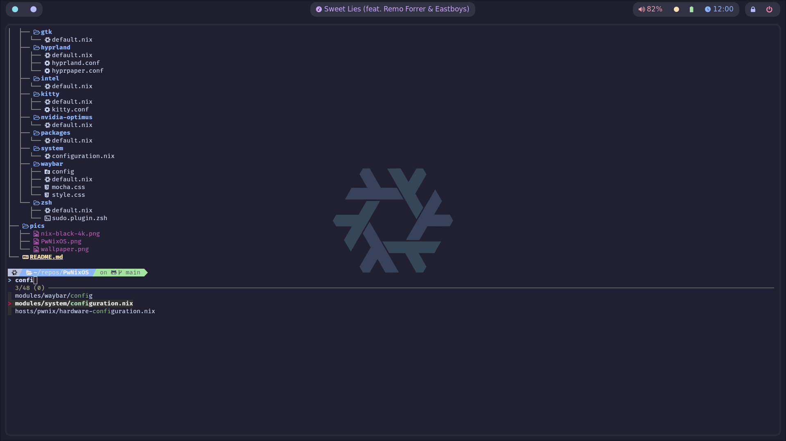
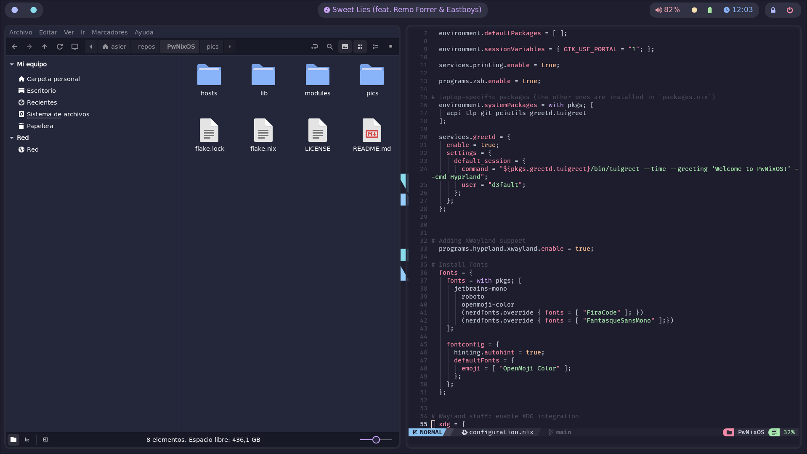
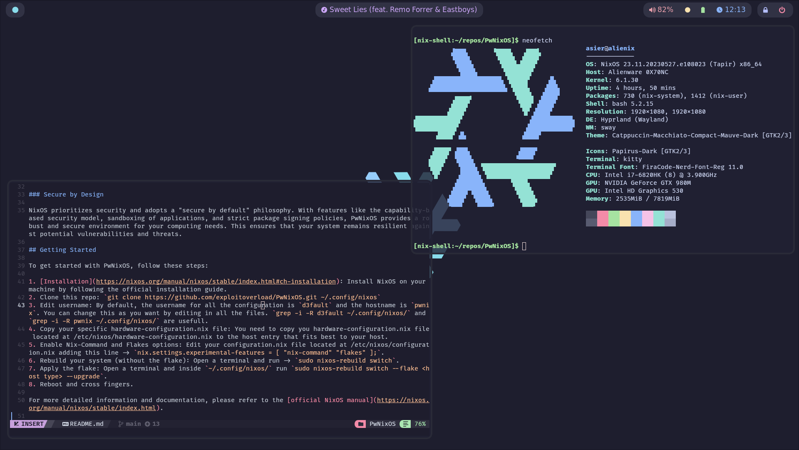

# PwNixOS: A Graphical-Centric and Hacking-Oriented NixOS Flake 

## Introduction

Welcome to PwNixOS, a NixOS Flake that combines a strong focus on productivity with powerful tools for hacking. 

## Screenshots

## Features

### UnixPorn at its core

PwNixOS places a strong emphasis on delivering a top-notch graphical experience by providing a visually appealing and productivity-focused interface. 

### Hacking Tools

PwNixOS offers a wide array of tools and utilities out of the box to support your hacking endeavors. From advanced network analysis and penetration testing tools to powerful scripting languages and development environments, PwNixOS equips you with the necessary arsenal to explore and manipulate computer systems to your heart's content. 

### Package Management with Nix

One of the standout features of NixOS is its unique package management system called Nix. With Nix, you can easily install, update, and manage software packages on your system. What makes Nix special is its ability to provide isolated and reproducible environments for each package, ensuring that software installations do not interfere with one another. This allows for painless experimentation and easy rollback to previous configurations.

### Declarative Configuration

NixOS follows a declarative approach to system configuration. Instead of making changes directly to the system, you define the desired state of your system in a configuration file or flake (like this one). This configuration specifies all the packages, services, and settings you want, providing a clear and reproducible blueprint for your system. This declarative nature simplifies system administration, enables easy replication of configurations across multiple machines, and facilitates version control of your system setup.

### Secure by Design

NixOS prioritizes security and adopts a "secure by default" philosophy. With features like the capability-based security model, sandboxing of applications, and strict package signing policies, PwNixOS provides a robust and secure environment for your computing needs. This ensures that your system remains resilient against potential vulnerabilities and threats.

### Custom packages

This flake has [custom hacking tools](https://github.com/exploitoverload/PwNixOS-Packages) that are uploaded to the NUR. The purpose of these tools is to fill in the gaps that exist today in the official repositories and create a full arsenal of tools, with well-known tools such as [BloodHound](https://github.com/BloodHoundAD/BloodHound) or [impacket](https://github.com/fortra/impacket) and lesser-known tools such as [psudohash](https://github.com/t3l3machus/psudohash).

## Getting Started

To get started with PwNixOS, follow these steps:

1. [Installation](https://nixos.org/manual/nixos/stable/index.html#ch-installation): Install NixOS on your machine by following the official installation guide.
2. Clone this repo: `git clone https://github.com/exploitoverload/PwNixOS.git ~/.config/nixos`
3. Edit username: By default, the username for all the configuration is `d3fault` and the hostname is `pwnix`. You can change this as you want by editing in all the files (don't forget to rename the folder inside hosts). `grep -i -R d3fault ~/.config/nixos/` and `grep -i -R pwnix ~/.config/nixos/` are usefull.
4. Copy your specific hardware-configuration.nix file: You need to copy you hardware-configuration.nix file located at /etc/nixos/hardware-configuration.nix to the host folder.
5. Review default.nix file inside pwnix host folder. It contains the configuration for nvidia-optimus and intel graphics. You have to choose one, comment the other.
6. Enable Nix-Command and Flakes options: Edit your configuration.nix file located at /etc/nixos/configuration.nix adding this line -> `nix.settings.experimental-features = [ "nix-command" "flakes" ];`.
7. Rebuild your system (without the flake): Open a terminal and run -> `sudo nixos-rebuild switch`. 
8. Apply the flake: Open a terminal and inside `~/.config/nixos/` run `sudo nixos-rebuild boot --flake <host type> --upgrade`.
9. Reboot and cross fingers.

## Keyboard Shortcuts

### General

| Action | Shortcut |
| ------ | -------- |
| Launch Terminal (kitty) | `WIN` + `ENTER` |
| Close App | `WIN` + `Q` |
| Launch App Selector | `WIN` + `D` |
| Show Power Menu | `WIN` + `X` |
| Lock Screen | `WIN` + `L` |
| Change Workspace | `WIN` + `1-9` |
| Move focused app to Workspace | `WIN` + `SHIFT` + `1-9` |
| Toggle floating mode in foused app | `WIN` + `V` |
| Toggle fullscreen mode in focused app | `WIN` + `F` |
| Take Screenshot (saved to clipboard) | `WIN` + `SHIFT` + `S` |
| In Floating, move window | `WIN` + `RIGHT_CLICK` + `MOVE_MOUSE` |
| In Floating, resize window | `WIN` + `LEFT_CLICK` + `MOVE_MOUSE` |
| Move focus | `WIN` + `ARROW_KEYS` |
| Move Apps in the workspace | `WIN` + `SHIFT` + `ARROW_KEYS` |
| Resize Apps | `WIN` + `CTRL` + `ARROW_KEYS` |

### Terminal (Kitty)

| Action | Shortcut |
| ------ | -------- |
| Copy selected text (Default Buffer) | `CTRL` + `SHIFT` + `C` |
| Paste selected text (Default Buffer) | `CTRL` + `SHIFT` + `V` |
| Copy selected text (Alternative Buffer 1) | `F1` |
| Paste selected text (Alternative Buffer 1) | `F2` |
| Copy selected text (Alternative Buffer 2) | `F3` |
| Paste selected text (Alternative Buffer 2) | `F4` |
| Show terminal history ([fzf](https://github.com/junegunn/fzf)) | `CTRL` + `R` |
| Search files recursively from current directory ([fzf](https://github.com/junegunn/fzf)) | `CTRL` + `T` |
| Create new pane inside the current tab | `CTRL` + `SHIFT` + `ENTER` |
| Create new tab | `CTRL` + `SHIFT` + `T` |
| Rename tab | `CTRL` + `SHIFT` + `ALT` + `T` |
| Change to next tab | `CTRL` + `TAB` |
| Close pane | `CTRL` + `SHIFT` + `W` |
| Change layout | `CTRL` + `SHIFT` + `L` |
| Move focuse to pane (same tab) | `CTRL` + `ARROW_KEYS` |

## TODO

- [ ] Add [NvChad](https://github.com/NvChad/NvChad) to the neovim configuration.
- [ ] Add IP Addresses for current interface to waybar with click to copy. 

For more detailed information and documentation, please refer to the [official NixOS manual](https://nixos.org/manual/nixos/stable/index.html).

## Special thanks to:

* [Notusknot dotfiles](https://github.com/notusknot/dotfiles-nix)
* [Catppuccin theme](https://github.com/catppuccin/catppuccin)
* [Rubyowo dotfiles](https://github.com/rubyowo/dotfiles)
